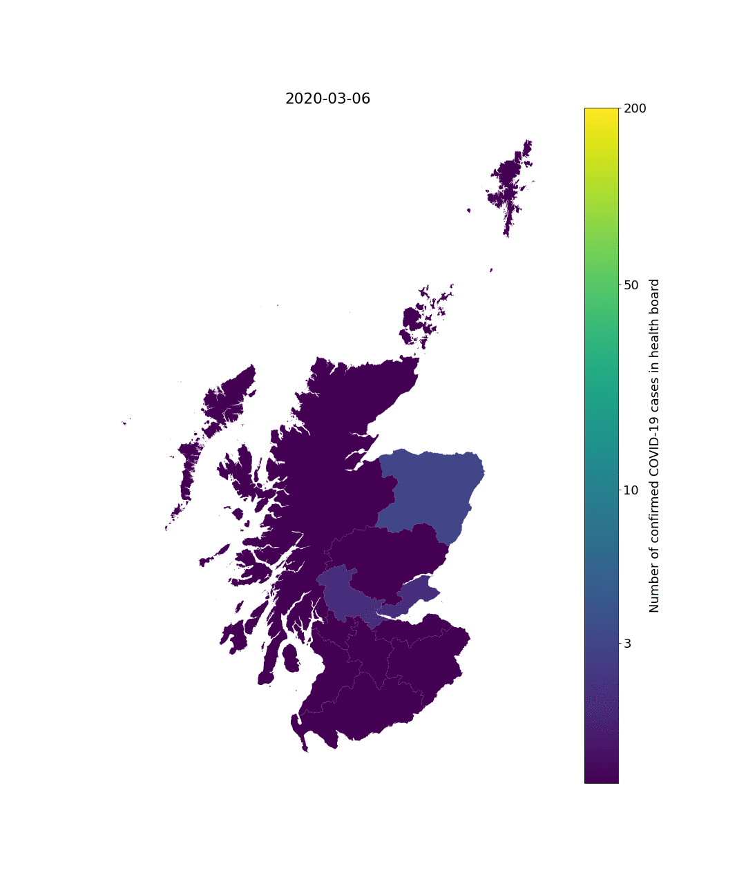
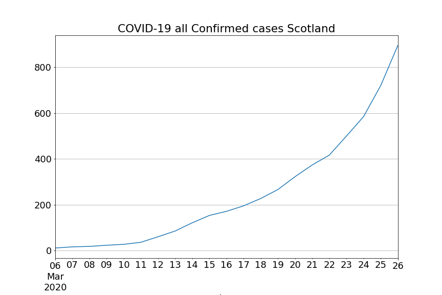
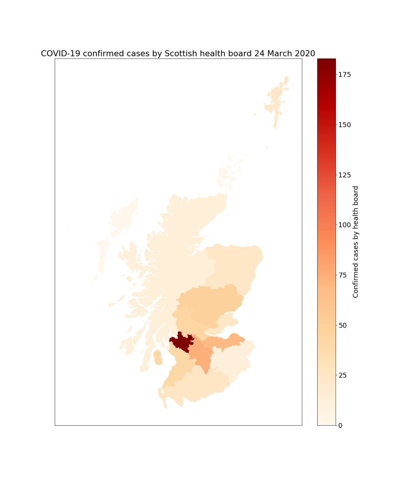
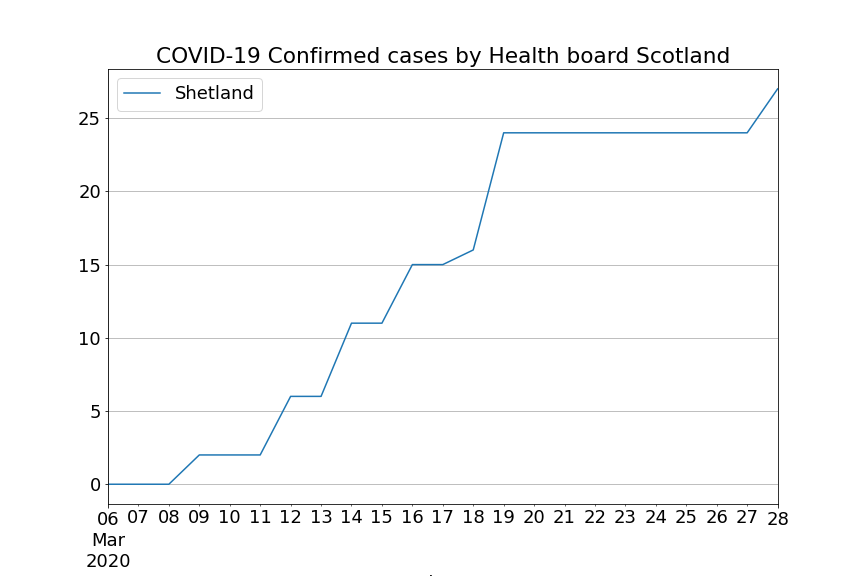

# Scotland COVID-19 data anlysis

Based upon [data published by the Scottish Government](https://www.gov.scot/coronavirus-covid-19/) and [archived copies from the WayBackMachine](https://web.archive.org/web/*/https://www.gov.scot/coronavirus-covid-19/)

[2020 coronavirus pandemic in Scotland on Wikipedia](https://en.wikipedia.org/wiki/2020_coronavirus_pandemic_in_Scotland)

[Daily % increase by health board table](output/daily_percentage_increase_by_health_board.md)

[Executable version of archive.org and live data on mybinder.org](https://mybinder.org/v2/gh/seumasmorrison/Scotland_COVID-19/master?filepath=Scotland_COVID-19.ipynb)

[Executable version of data derived from Wikipedia UK COVID-19 Scotland table](https://mybinder.org/v2/gh/seumasmorrison/Scotland_COVID-19/master?filepath=Scotland_COVID-19_Wikipedia_data.ipynb)
